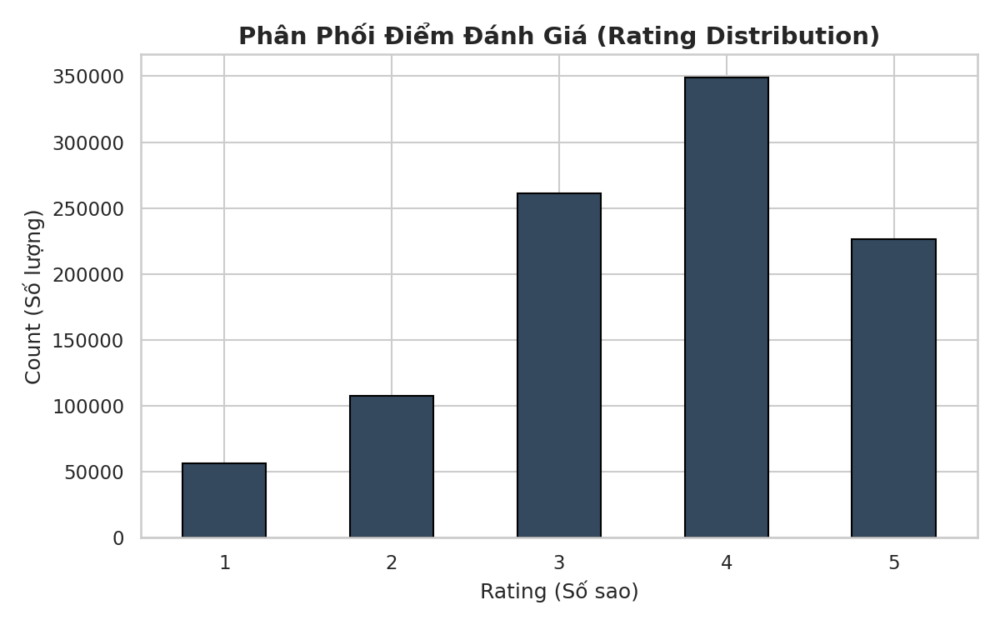
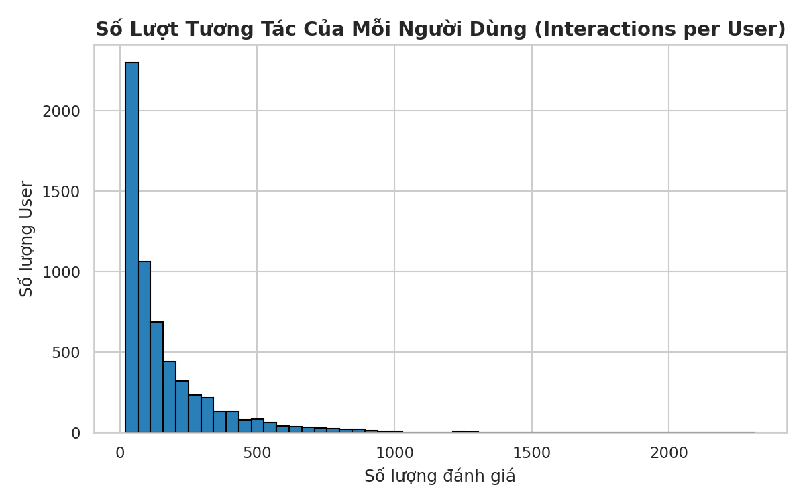
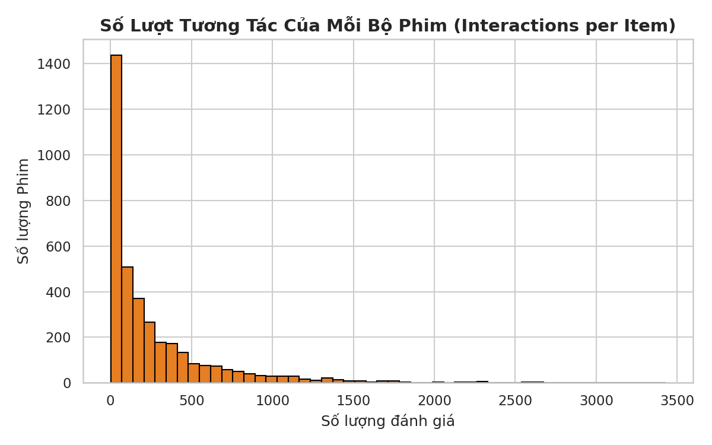
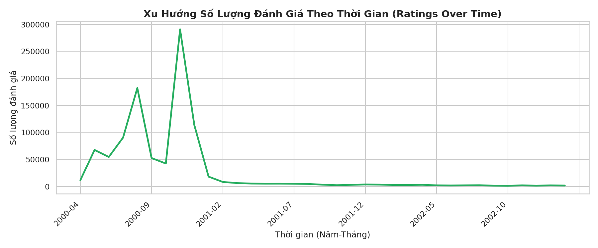
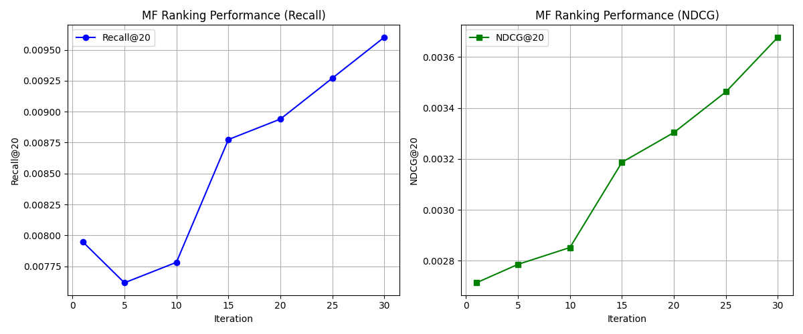
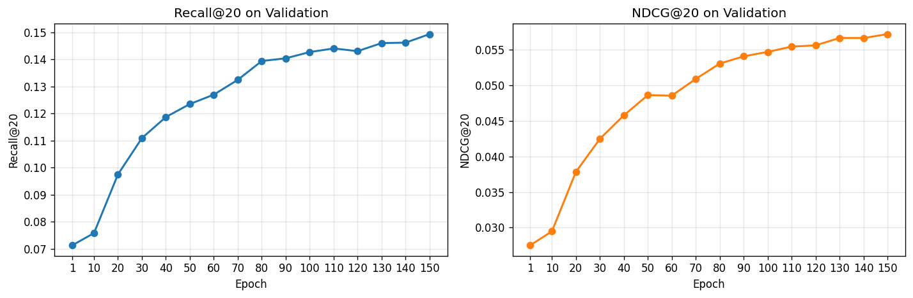
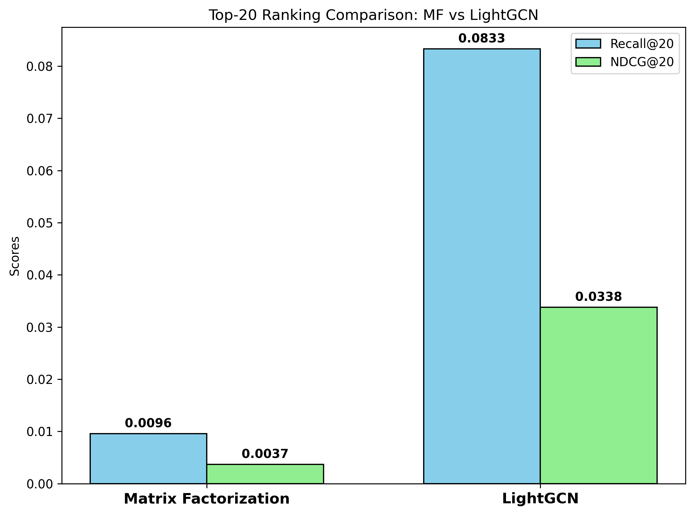
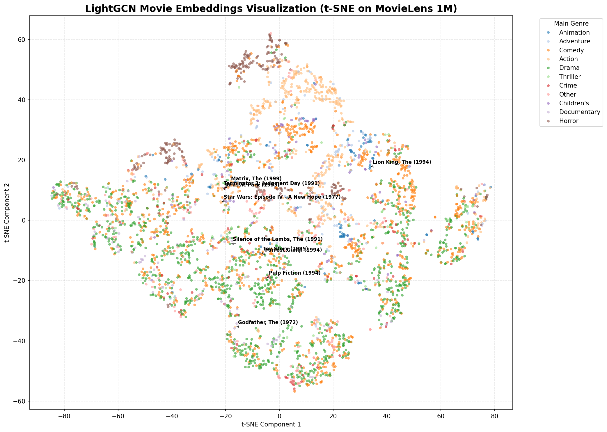
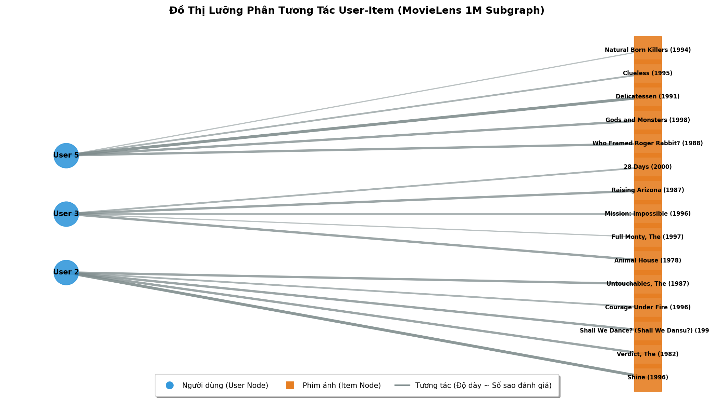

# BÁO CÁO ĐỒ ÁN MÔN HỌC: HỆ THỐNG GỢI Ý PHIM (RECOMMENDER SYSTEMS)
## Đề tài: Nghiên cứu và So sánh Mô hình Matrix Factorization và LightGCN trên Dataset MovieLens 1M

---

## THÔNG TIN CHUNG
* **Môn học:** Hệ Gợi Ý / Khai Phá Dữ Liệu
* **Đề tài:** So sánh hiệu năng Xếp hạng Top-N giữa Matrix Factorization & LightGCN trên MovieLens 1M
* **Môi trường triển khai:** Docker Container (PyTorch, CUDA 12.1, Python 3.10), Host OS: Windows 11
* **Dataset:** MovieLens 1M (ML-1M)

---

## CHƯƠNG 1: GIỚI THIỆU BÀI TOÁN VÀ ĐỀ TÀI

### 1.1. Đặt vấn đề
Trong kỷ nguyên số hóa, sự bùng nổ nội dung số đặt ra thách thức lớn cho người dùng trong việc tìm kiếm thông tin phù hợp, và cho doanh nghiệp trong việc giữ chân khách hàng. Hệ thống gợi ý (Recommender Systems) đã trở thành thành phần cốt lõi của các nền tảng như Netflix, YouTube, Spotify — giúp cá nhân hóa trải nghiệm bằng cách tự động đề xuất nội dung dựa trên lịch sử hành vi.

### 1.2. Phát biểu bài toán
Cho tập người dùng $U = \{u_1, ..., u_M\}$ và tập phim $I = \{i_1, ..., i_N\}$. Ma trận tương tác $R \in \mathbb{R}^{M \times N}$ ghi nhận lịch sử đánh giá. Bài toán được chia làm hai hướng:
1. **Dự đoán điểm (Rating Prediction):** Ước lượng điểm số cụ thể (1–5 sao) mà người dùng sẽ chấm cho phim.
2. **Gợi ý Top-N (Top-N Ranking):** Trả về danh sách $N$ phim mà người dùng có khả năng tương tác cao nhất. Đây là hướng tiếp cận sát thực tế hơn.

### 1.3. Mục tiêu đồ án
Đồ án được thiết kế với 3 phân hệ cốt lõi hoạt động độc lập nhưng phối hợp chặt chẽ:
1. **Data Pipeline (Tiền xử lý & Phân chia dữ liệu):** Xử lý dữ liệu thô, tạo ra các bộ train/val/test dùng chung cho tất cả mô hình theo chuẩn Leave-One-Out, đảm bảo so sánh công bằng.
2. **Matrix Factorization (MF) with Bias:** Mô hình phân rã ma trận truyền thống, tối ưu sai số dự đoán điểm số (MSE Loss).
3. **LightGCN:** Mô hình học sâu trên đồ thị, tối ưu trực tiếp bài toán xếp hạng (BPR Loss).

---

## CHƯƠNG 2: HỆ THỐNG TIỀN XỬ LÝ VÀ PHÂN TÍCH DỮ LIỆU (DATA PIPELINE)
Data Pipeline đóng vai trò nền tảng, đảm bảo mọi mô hình được huấn luyện và đánh giá trên cùng một bộ dữ liệu, cho phép so sánh công bằng tuyệt đối (Apple-to-Apple).

### 2.1. Mô tả Dữ liệu MovieLens 1M
Tập dữ liệu do GroupLens Research cung cấp, bao gồm 3 tệp chính:
* `ratings.dat`: 1,000,209 bản ghi đánh giá (UserID::MovieID::Rating::Timestamp).
* `users.dat`: Thông tin nhân khẩu học người dùng.
* `movies.dat`: Thông tin phim (tên, thể loại).

### 2.2. Phân tích Dữ liệu Khám phá (EDA)

#### 2.2.1. Thống kê cơ bản
| Chỉ số | Giá trị |
| :--- | :--- |
| Số lượng Người dùng | 6,040 |
| Số lượng Phim | 3,706 |
| Số lượng Tương tác | 1,000,209 |
| Độ thưa thớt (Sparsity) | **95.53%** |

$$\text{Sparsity} = 1 - \frac{1{,}000{,}209}{6{,}040 \times 3{,}706} \approx 95.53\%$$

#### 2.2.2. Trực quan hóa dữ liệu

##### A. Phân phối Điểm đánh giá
Người dùng MovieLens có xu hướng đánh giá tích cực: điểm 4 sao chiếm đa số (hơn 340,000 lượt), tiếp theo là 3 và 5 sao. Điểm 1–2 sao chiếm tỷ lệ rất thấp.

*Hình 1: Phân phối điểm đánh giá 1–5 sao.*

##### B. Phân phối Tương tác theo Người dùng
Mỗi người dùng có tối thiểu 20 lượt đánh giá. Phần lớn tập trung dưới 200 lượt, nhưng tồn tại nhóm nhỏ "siêu hoạt động" có hàng ngàn đánh giá — đóng vai trò nút trung tâm trong đồ thị lưỡng phân.

*Hình 2: Phân phối số tương tác của từng User.*

##### C. Phân phối Tương tác theo Phim
Dữ liệu tuân theo quy luật **Đuôi dài (Long Tail)**: một số ít phim bom tấn nhận lượng tương tác khổng lồ, trong khi đa số phim chỉ nhận vài đánh giá.

*Hình 3: Phân phối số tương tác của từng Movie (Long Tail).*

##### D. Xu hướng Đánh giá theo Thời gian
Lượng tương tác bùng nổ vào nửa cuối năm 2000 (giai đoạn thu thập dữ liệu tập trung của GroupLens), sau đó giảm dần và ổn định.

*Hình 4: Biến động số lượng đánh giá theo thời gian.*

### 2.3. Tiền xử lý dữ liệu (Data Preprocessing)
Toàn bộ quá trình tiền xử lý được thực hiện tập trung trong kịch bản `data/generate_splits.py`, gồm 4 bước:

1. **Lọc nhiễu (K-core Filtering):** Loại bỏ người dùng có ít hơn 10 tương tác. Dù ML-1M đã yêu cầu tối thiểu 20, bước này đảm bảo tính tổng quát khi áp dụng cho dataset khác.
2. **Mã hóa lại ID (Re-indexing):** Ánh xạ toàn bộ UserID và MovieID gốc thành dãy số nguyên liên tục $[0, N-1]$. Đây là bước bắt buộc để các ID có thể dùng trực tiếp làm chỉ mục trong Embedding Matrix, tránh lãng phí bộ nhớ.
3. **Sắp xếp theo thời gian (Chronological Sorting):** Dữ liệu của mỗi người dùng được sắp xếp tăng dần theo Timestamp, bảo toàn tính nhân quả của hành vi.
4. **Phân chia Leave-One-Out:** Với mỗi người dùng (có ≥ 3 tương tác): tương tác cuối cùng → `test.csv`, tương tác áp chót → `val.csv`, phần còn lại → `train.csv`. Ba tệp vật lý này được dùng chung cho mọi mô hình, ngăn chặn triệt để hiện tượng rò rỉ dữ liệu (Data Leakage).

---

## CHƯƠNG 3: CƠ SỞ LÝ THUYẾT

### 3.1. Mô hình Matrix Factorization (MF) tích hợp Bias
MF phân rã ma trận đánh giá thưa $R$ thành tích hai ma trận đặc trưng ẩn chiều thấp: $W \in \mathbb{R}^{K \times M}$ (người dùng) và $X \in \mathbb{R}^{N \times K}$ (phim), với $K$ là số nhân tử ẩn.

#### Công thức dự đoán:
$$\hat{r}_{u,i} = W_u^T X_i + b_u + b_i + \mu$$

Trong đó:
* $W_u \in \mathbb{R}^K$: vector biểu diễn ẩn của người dùng $u$.
* $X_i \in \mathbb{R}^K$: vector biểu diễn ẩn của phim $i$.
* $b_u$: bias của người dùng (khó tính hay dễ tính).
* $b_i$: bias của phim (phổ biến hay ngách).
* $\mu$: điểm trung bình toàn hệ thống.

#### Hàm mất mát:
$$\mathcal{L}_{MF} = \frac{1}{|R_{train}|}\sum_{(u,i) \in R_{train}} (r_{u,i} - \hat{r}_{u,i})^2 + \lambda \left( \|W_u\|_2^2 + \|X_i\|_2^2 + b_u^2 + b_i^2 \right)$$

Mô hình được huấn luyện bằng Gradient Descent, cập nhật lần lượt theo từng Item rồi từng User.

---

### 3.2. Mô hình LightGCN
LightGCN là phiên bản tối giản của Graph Convolutional Network, loại bỏ hoàn toàn phép biến đổi phi tuyến và ma trận trọng số — hai thành phần được chứng minh là không cần thiết cho tác vụ gợi ý.

#### 3.2.1. Đồ thị lưỡng phân
Tương tác User-Item được biểu diễn dưới dạng đồ thị lưỡng phân vô hướng $G = (U \cup I, E)$. Mỗi cạnh $(u, i) \in E$ nghĩa là người dùng $u$ đã đánh giá phim $i$.

#### 3.2.2. Lan truyền đặc trưng
Tại lớp $k$, embedding của mỗi nút được cập nhật bằng trung bình có trọng số embedding của các nút láng giềng:
$$e_u^{(k+1)} = \sum_{i \in \mathcal{N}_u} \frac{1}{\sqrt{|\mathcal{N}_u|} \cdot \sqrt{|\mathcal{N}_i|}} \; e_i^{(k)}$$
$$e_i^{(k+1)} = \sum_{u \in \mathcal{N}_i} \frac{1}{\sqrt{|\mathcal{N}_i|} \cdot \sqrt{|\mathcal{N}_u|}} \; e_u^{(k)}$$

Hệ số chuẩn hóa $D^{-1/2} A D^{-1/2}$ ngăn bùng nổ trị số khi lan truyền qua nút có bậc lớn.

#### 3.2.3. Kết hợp đa lớp
Embedding cuối cùng là trung bình cộng embedding ở tất cả các lớp (bao gồm lớp 0):
$$e_u = \frac{1}{K+1}\sum_{k=0}^K e_u^{(k)} \qquad e_i = \frac{1}{K+1}\sum_{k=0}^K e_i^{(k)}$$

#### 3.2.4. Hàm mất mát BPR
LightGCN tối ưu trực tiếp bài toán xếp hạng thông qua Bayesian Personalized Ranking. Với mỗi bộ ba $(u, i, j)$ — người dùng $u$ đã xem phim $i$ nhưng chưa xem phim $j$:
$$\mathcal{L}_{BPR} = -\sum_{(u,i,j)} \ln \sigma \left( e_u^T e_i - e_u^T e_j \right) + \lambda \|E^{(0)}\|_2^2$$

---

## CHƯƠNG 4: THIẾT KẾ CÀI ĐẶT VÀ TỐI ƯU HÓA

### 4.1. Tối ưu hóa Matrix Factorization
Trong các cài đặt thông thường, mỗi bước cập nhật SGD cần tìm kiếm tuyến tính các tương tác liên quan đến từng User/Item, có độ phức tạp $O(N)$.

* **Giải pháp:** Xây dựng trước bảng chỉ mục `user_to_rating_indices` và `item_to_rating_indices` trong pha khởi tạo. Mỗi lần cập nhật, truy cập trực tiếp bộ nhớ với $O(1)$.
* **Kết quả:** 30 epoch trên 1 triệu tương tác hoàn thành trong **~50 giây** trên CPU.

### 4.2. Tối ưu hóa LightGCN
Nút thắt cổ chai nằm ở khâu Negative Sampling của BPR: kiểm tra xem phim ngẫu nhiên $j$ có nằm trong lịch sử tương tác của người dùng $u$ hay không.

* **Giải pháp:** Lưu lịch sử tương tác dưới dạng `Python Set` (`user_pos_set`), giúp phép kiểm tra `neg not in u_set` đạt $O(1)$ trung bình. Đồng thời tăng batch size lên 8192 để tận dụng song song hóa GPU.
* **Kết quả:** Mỗi epoch giảm từ ~2 phút xuống **~15 giây**. Toàn bộ 15 epoch hoàn thành trong **~4 phút** trên GPU CUDA.

### 4.3. Siêu tham số
| Siêu tham số | MF | LightGCN |
| :--- | :--- | :--- |
| Kích thước nhúng ($K$) | 20 | 64 |
| Tốc độ học | 0.5 | 0.002 |
| Hệ số chuẩn hóa ($\lambda$) | 0.05 | 1e-4 |
| Số epoch | 30 | 15 |
| Batch size | Full-batch | 8192 |
| Số lớp lan truyền | — | 3 |
| Phân chia dữ liệu | Leave-One-Out (chung) | Leave-One-Out (chung) |

---

## CHƯƠNG 5: KẾT QUẢ THỰC NGHIỆM

### 5.1. Chỉ số đánh giá
Cả hai mô hình đều được đánh giá trên cùng tập Validation theo giao thức Leave-One-Out, sử dụng hai chỉ số xếp hạng Top-20:

* **Recall@20:** Tỷ lệ bộ phim ground-truth xuất hiện trong danh sách Top 20 gợi ý. Recall = 1 nếu phim đúng nằm trong Top 20, ngược lại = 0. Giá trị cuối cùng là trung bình trên toàn bộ người dùng.
* **NDCG@20 (Normalized Discounted Cumulative Gain):** Tương tự Recall nhưng có trọng số vị trí — phim đúng ở vị trí đầu danh sách được tính điểm cao hơn phim đúng ở vị trí cuối.

### 5.2. Kết quả Matrix Factorization
MF vốn được thiết kế để dự đoán điểm số (tối ưu MSE), nhưng trong đồ án này được đánh giá thêm trên bài toán Ranking: tại mỗi epoch, mô hình tính điểm tương thích cho toàn bộ phim chưa xem của mỗi người dùng, loại bỏ phim đã xem, rồi lọc ra Top 20.

* **Recall@20 = 0.0096** | **NDCG@20 = 0.0037** (Epoch 30)

*Hình 5: Recall@20 và NDCG@20 của MF qua các epoch.*

---

### 5.3. Kết quả LightGCN
LightGCN tối ưu trực tiếp bài toán xếp hạng qua BPR Loss, và được đánh giá mỗi 3 epoch.

* **Recall@20 = 0.0833** | **NDCG@20 = 0.0338** (Epoch 15)

*Hình 6: Recall@20 và NDCG@20 của LightGCN qua các epoch.*

---

### 5.4. So sánh đối chứng
Cả hai mô hình chạy trên cùng bộ dữ liệu Leave-One-Out do Data Pipeline sinh ra, đảm bảo so sánh công bằng.

*Hình 7: So sánh Recall@20 và NDCG@20 giữa MF và LightGCN.*

| Mô hình | Recall@20 | NDCG@20 |
| :--- | :--- | :--- |
| Matrix Factorization | 0.0096 | 0.0037 |
| **LightGCN** | **0.0833** | **0.0338** |

**Phân tích:**
* LightGCN vượt trội hơn MF **gần 9 lần** ở Recall@20. Nguyên nhân cốt lõi: MF tối ưu sai số điểm số (Pointwise MSE) — một mô hình dự đoán tốt giá trị rating chưa chắc đã xếp hạng đúng thứ tự các phim. Trong khi đó, LightGCN tối ưu trực tiếp khoảng cách xếp hạng giữa phim đã xem và chưa xem (Pairwise BPR Loss).
* Ngoài ra, MF chỉ học đặc trưng từ tương tác trực tiếp (bậc 1). LightGCN khai thác thông tin cộng tác đa bậc trên đồ thị: "người dùng A xem phim X → phim X cũng được xem bởi người dùng B → người dùng B còn xem phim Y → gợi ý phim Y cho A".

---

### 5.5. Trực quan hóa Embedding phim
Ma trận nhúng 64 chiều của 3,706 phim được trích xuất từ LightGCN, giảm chiều xuống 2D bằng t-SNE và tô màu theo thể loại chính.

*Hình 8: Không gian nhúng phim. Phim cùng thể loại tự động tụ thành cụm dù mô hình không được cung cấp nhãn thể loại khi huấn luyện.*

**Nhận xét:**
1. Phim Hoạt hình (Animation) tạo thành cụm tách biệt rõ ràng.
2. Phim Hành động (Action) và Viễn tưởng (Sci-Fi) tụ lại gần nhau.
3. Phim Hài (Comedy) phân bố rộng hơn ở trung tâm — phản ánh tính chất phổ biến và dễ kết hợp với thể loại khác.

### 5.6. Trực quan hóa Đồ thị lưỡng phân
Trích xuất 10 người dùng ngẫu nhiên cùng các phim họ đã xem, vẽ dưới dạng mạng lưới.

*Hình 9: Đồ thị lưỡng phân User (cam) – Movie (xanh). Phim phổ biến nằm ở trung tâm, đóng vai trò cầu nối giữa các User.*

### 5.7. Bảng tổng kết

| Tiêu chí | Matrix Factorization | LightGCN |
| :--- | :--- | :--- |
| **Loại mô hình** | Phân rã ma trận | Mạng đồ thị tích chập |
| **Hàm mất mát** | Pointwise MSE Loss | Pairwise BPR Loss |
| **Đặc trưng học được** | Nhân tử ẩn độc lập (bậc 1) | Embedding đa bậc qua láng giềng |
| **Recall@20** | 0.0096 | **0.0833** |
| **NDCG@20** | 0.0037 | **0.0338** |

---

## CHƯƠNG 6: KẾT LUẬN VÀ HƯỚNG PHÁT TRIỂN

### 6.1. Kết luận
1. Xây dựng thành công Data Pipeline tập trung xử lý dữ liệu theo chuẩn Leave-One-Out, đảm bảo mọi mô hình được so sánh trên cùng một bộ test.
2. Cài đặt và tối ưu hóa hai mô hình Matrix Factorization và LightGCN bằng Python & PyTorch, đạt tốc độ huấn luyện cao.
3. Thực nghiệm chứng minh LightGCN vượt trội hoàn toàn so với MF trong bài toán gợi ý Top-N, nhờ tối ưu trực tiếp hàm xếp hạng và khai thác thông tin cộng tác đa bậc trên đồ thị.

### 6.2. Hướng phát triển
* **Giải quyết Cold Start:** Tích hợp thông tin phụ (tuổi, giới tính, thể loại phim) qua Graph Attention Network (GAT).
* **Gợi ý thời gian thực:** Kết hợp LightGCN với Vector Database (FAISS/Milvus) phục vụ gợi ý qua API.
* **Đa hành vi:** Khai thác nhiều loại tương tác (xem trailer, thêm yêu thích, đánh giá) để xây dựng mô hình gợi ý đa đồ thị.
