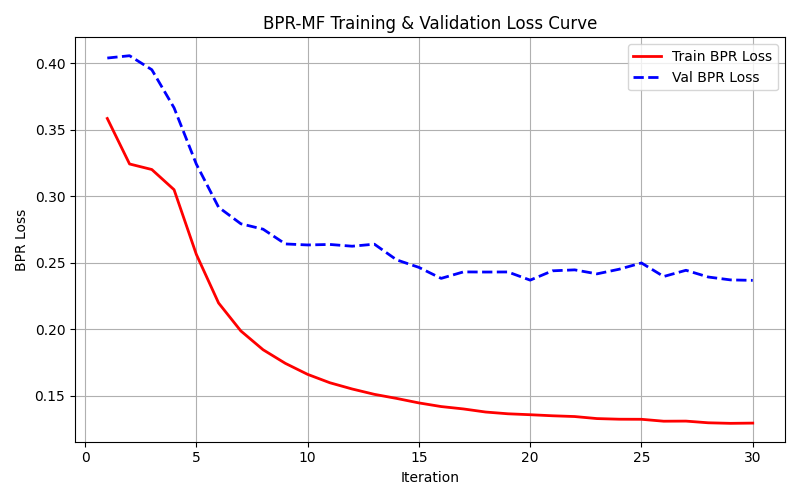
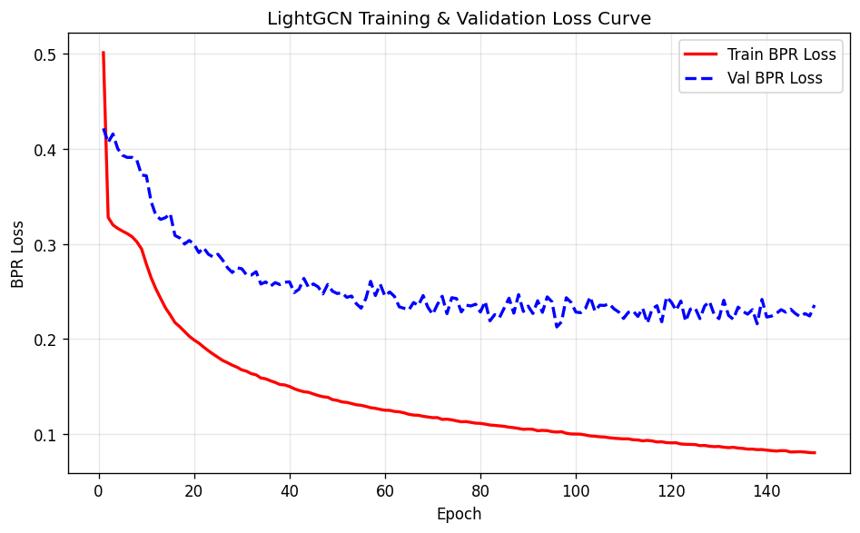

# BÁO CÁO ĐỒ ÁN MÔN HỌC: HỆ THỐNG GỢI Ý PHIM (RECOMMENDER SYSTEMS)
## Đề tài: Nghiên cứu và So sánh Mô hình Matrix Factorization và LightGCN trên Dataset MovieLens 1M

---

## THÔNG TIN CHUNG
* **Môn học:** Hệ Gợi Ý / Khai Phá Dữ Liệu
* **Đề tài:** So sánh hiệu năng Xếp hạng Top-N giữa Matrix Factorization & LightGCN trên MovieLens 1M
* **Môi trường triển khai:** Docker Container (PyTorch, CUDA 12.1, Python 3.10), Host OS: Windows 11
* **Dataset:** MovieLens 1M (ML-1M)

---

## CHƯƠNG 1: GIỚI THIỆU BÀI TOÁN VÀ ĐỀ TÀI

### 1.1. Đặt vấn đề
Trong kỷ nguyên số hóa, sự bùng nổ nội dung số đặt ra thách thức lớn cho người dùng trong việc tìm kiếm thông tin phù hợp, và cho doanh nghiệp trong việc giữ chân khách hàng. Hệ thống gợi ý (Recommender Systems) đã trở thành thành phần cốt lõi của các nền tảng như Netflix, YouTube, Spotify — giúp cá nhân hóa trải nghiệm bằng cách tự động đề xuất nội dung dựa trên lịch sử hành vi.

### 1.2. Phát biểu bài toán
Cho tập người dùng $U = \{u_1, ..., u_M\}$ và tập phim $I = \{i_1, ..., i_N\}$. Ma trận tương tác $R \in \mathbb{R}^{M \times N}$ ghi nhận lịch sử đánh giá. Bài toán được chia làm hai hướng:
1. **Dự đoán điểm (Rating Prediction):** Ước lượng điểm số cụ thể (1–5 sao) mà người dùng sẽ chấm cho phim.
2. **Gợi ý Top-N (Top-N Ranking):** Trả về danh sách $N$ phim mà người dùng có khả năng tương tác cao nhất. Đây là hướng tiếp cận sát thực tế hơn.

### 1.3. Mục tiêu đồ án
Đồ án được thiết kế với 3 phân hệ cốt lõi hoạt động độc lập nhưng phối hợp chặt chẽ:
1. **Data Pipeline (Tiền xử lý & Phân chia dữ liệu):** Xử lý dữ liệu thô, tạo ra các bộ train/val/test dùng chung cho tất cả mô hình theo chuẩn Leave-One-Out, đảm bảo so sánh công bằng.
2. **BPR-MF (Bayesian Personalized Ranking Matrix Factorization):** Mô hình phân rã ma trận tối ưu hóa xếp hạng theo cặp, sử dụng hàm mất mát BPR Loss để giải quyết bài toán gợi ý Top-N.
3. **LightGCN:** Mô hình học sâu trên đồ thị, tối ưu trực tiếp bài toán xếp hạng (BPR Loss).

---

## CHƯƠNG 2: HỆ THỐNG TIỀN XỬ LÝ VÀ PHÂN TÍCH DỮ LIỆU (DATA PIPELINE)
Data Pipeline đóng vai trò nền tảng, đảm bảo mọi mô hình được huấn luyện và đánh giá trên cùng một bộ dữ liệu, cho phép so sánh công bằng tuyệt đối (Apple-to-Apple).

### 2.1. Mô tả Dữ liệu MovieLens 1M
Tập dữ liệu do GroupLens Research cung cấp, bao gồm 3 tệp chính:
* `ratings.dat`: 1,000,209 bản ghi đánh giá (UserID::MovieID::Rating::Timestamp).
* `users.dat`: Thông tin nhân khẩu học người dùng.
* `movies.dat`: Thông tin phim (tên, thể loại).

### 2.2. Phân tích Dữ liệu Khám phá (EDA)

#### 2.2.1. Thống kê cơ bản
| Chỉ số | Giá trị |
| :--- | :--- |
| Số lượng Người dùng | 6,040 |
| Số lượng Phim | 3,706 |
| Số lượng Tương tác | 1,000,209 |
| Độ thưa thớt (Sparsity) | **95.53%** |

$$\text{Sparsity} = 1 - \frac{1{,}000{,}209}{6{,}040 \times 3{,}706} \approx 95.53\%$$

#### 2.2.2. Trực quan hóa dữ liệu

##### A. Phân phối Điểm đánh giá
Người dùng MovieLens có xu hướng đánh giá tích cực: điểm 4 sao chiếm đa số (hơn 340,000 lượt), tiếp theo là 3 và 5 sao. Điểm 1–2 sao chiếm tỷ lệ rất thấp.

*Hình 1: Phân phối điểm đánh giá 1–5 sao.*

##### B. Phân phối Tương tác theo Người dùng
Mỗi người dùng có tối thiểu 20 lượt đánh giá. Phần lớn tập trung dưới 200 lượt, nhưng tồn tại nhóm nhỏ "siêu hoạt động" có hàng ngàn đánh giá — đóng vai trò nút trung tâm trong đồ thị lưỡng phân.

*Hình 2: Phân phối số tương tác của từng User.*

##### C. Phân phối Tương tác theo Phim
Dữ liệu tuân theo quy luật **Đuôi dài (Long Tail)**: một số ít phim bom tấn nhận lượng tương tác khổng lồ, trong khi đa số phim chỉ nhận vài đánh giá.

*Hình 3: Phân phối số tương tác của từng Movie (Long Tail).*

##### D. Xu hướng Đánh giá theo Thời gian
Lượng tương tác bùng nổ vào nửa cuối năm 2000 (giai đoạn thu thập dữ liệu tập trung của GroupLens), sau đó giảm dần và ổn định.

*Hình 4: Biến động số lượng đánh giá theo thời gian.*

### 2.3. Tiền xử lý dữ liệu (Data Preprocessing)
Toàn bộ quá trình tiền xử lý được thực hiện tập trung trong kịch bản `data/generate_splits.py`, gồm các bước cốt lõi sau:

1. **Lọc nhiễu (K-core Filtering):** Loại bỏ người dùng có ít hơn 10 tương tác. Đối với MovieLens 1M, do GroupLens đã lọc sẵn người dùng có tối thiểu 20 tương tác, bước này giữ nguyên toàn bộ 6,040 người dùng, nhưng đảm bảo tính tổng quát khi áp dụng mã nguồn cho các tập dữ liệu thực tế khác.
2. **Mã hóa lại ID (Re-indexing):** Ánh xạ toàn bộ UserID gốc ($1 \to 6040$) và MovieID gốc (lên tới $3952$, có các ID trống) thành các chuỗi số nguyên liên tục bắt đầu từ 0: Users $\in [0, 6039]$ và Movies $\in [0, 3705]$. Đây là bước bắt buộc để các ID có thể được sử dụng trực tiếp làm chỉ mục (index) truy xuất trong ma trận nhúng (Embedding Matrix), tránh lãng phí bộ nhớ VRAM/RAM cho các ID bị thiếu.
3. **Sắp xếp theo thời gian (Chronological Sorting):** Lịch sử tương tác của mỗi người dùng được sắp xếp tăng dần theo thời gian (Timestamp), đảm bảo thứ tự nhân quả của hành vi tiêu dùng phim.
4. **Nhị phân hóa tương tác (Binarization):** Chuyển đổi dữ liệu đánh giá dạng tường minh (Explicit Feedback - điểm số từ 1 đến 5 sao) thành dạng ẩn (Implicit Feedback). Bất kể số sao đánh giá là bao nhiêu, mọi tương tác đã xảy ra đều được coi là một tương tác tích cực (Positive Interaction, nhãn là 1), và các tương tác chưa xảy ra được coi là âm tính (Negative Interaction, nhãn là 0). Điều này phù hợp với mục tiêu tối ưu xếp hạng (Ranking) của BPR Loss.
5. **Phân chia Leave-One-Out (Bớt một):** Với mỗi người dùng (đảm bảo có $\ge 3$ tương tác):
   * Tương tác cuối cùng theo thời gian $\to$ đưa vào tập **Test** (`test.csv`) để làm thước đo hiệu năng cuối cùng.
   * Tương tác áp chót theo thời gian $\to$ đưa vào tập **Validation** (`val.csv`) để điều chỉnh siêu tham số và chạy Early Stopping.
   * Tất cả các tương tác trước đó $\to$ giữ lại ở tập **Train** (`train.csv`) để huấn luyện mô hình.

#### Thống kê bộ dữ liệu sau phân chia:
| Bộ dữ liệu | Số lượng bản ghi | Tỷ lệ (%) | Ý nghĩa học máy |
| :--- | :---: | :---: | :--- |
| **Train Set** (`train.csv`) | 988,129 | 98.80% | Dùng để huấn luyện tham số nhúng (Embeddings) của mô hình. |
| **Validation Set** (`val.csv`) | 6,040 | 0.60% | Dùng để đánh giá chéo định kỳ, tinh chỉnh siêu tham số và chạy Early Stopping. |
| **Test Set** (`test.csv`) | 6,040 | 0.60% | Dùng để kiểm định hiệu năng khách quan cuối cùng sau khi hoàn tất huấn luyện. |
| **Tổng cộng (MovieLens 1M)** | **1,000,209** | **100.00%** | Độ thưa thớt của dữ liệu huấn luyện (Sparsity) là **95.58%**. |

---

## CHƯƠNG 3: CƠ SỞ LÝ THUYẾT

### 3.1. Mô hình BPR-MF (Bayesian Personalized Ranking Matrix Factorization)
BPR-MF phân rã ma trận tương tác thưa thành tích hai ma trận đặc trưng ẩn chiều thấp: $W \in \mathbb{R}^{K \times M}$ (người dùng) và $X \in \mathbb{R}^{N \times K}$ (phim), với $K$ là số nhân tử ẩn. 

#### Công thức dự đoán điểm tương thích:
$$\hat{x}_{u,i} = W_u^T X_i + b_i$$

Trong đó:
* $W_u \in \mathbb{R}^K$: vector biểu diễn đặc trưng ẩn của người dùng $u$.
* $X_i \in \mathbb{R}^K$: vector biểu diễn đặc trưng ẩn của phim $i$.
* $b_i$: bias của phim (độ phổ biến của bộ phim).

#### Hàm mất mát BPR Loss (Pairwise):
Mô hình tối ưu hóa dựa trên việc so sánh các cặp phim: đối với mỗi người dùng $u$, điểm số của phim đã xem $i$ phải cao hơn phim chưa xem $j$:
$$\mathcal{L}_{BPR} = -\sum_{(u,i,j) \in D_S} \ln \sigma \left( \hat{x}_{u,i} - \hat{x}_{u,j} \right) + \lambda \left( \|W_u\|_2^2 + \|X_i\|_2^2 + \|X_j\|_2^2 + b_i^2 + b_j^2 \right)$$

Trong đó $D_S$ là tập hợp các bộ ba $(u, i, j)$ thỏa mãn điều kiện phim $i$ đã tương tác và phim $j$ chưa tương tác. Mô hình được huấn luyện bằng thuật toán Stochastic Gradient Descent (SGD) trên các bộ ba này.

---

### 3.2. Mô hình LightGCN
LightGCN là phiên bản tối giản của Graph Convolutional Network, loại bỏ hoàn toàn phép biến đổi phi tuyến và ma trận trọng số — hai thành phần được chứng minh là không cần thiết cho tác vụ gợi ý.

#### 3.2.1. Đồ thị lưỡng phân
Tương tác User-Item được biểu diễn dưới dạng đồ thị lưỡng phân vô hướng $G = (U \cup I, E)$. Mỗi cạnh $(u, i) \in E$ nghĩa là người dùng $u$ đã đánh giá phim $i$.

#### 3.2.2. Lan truyền đặc trưng
Tại lớp $k$, embedding của mỗi nút được cập nhật bằng trung bình có trọng số embedding của các nút láng giềng:
$$e_u^{(k+1)} = \sum_{i \in \mathcal{N}_u} \frac{1}{\sqrt{|\mathcal{N}_u|} \cdot \sqrt{|\mathcal{N}_i|}} \; e_i^{(k)}$$
$$e_i^{(k+1)} = \sum_{u \in \mathcal{N}_i} \frac{1}{\sqrt{|\mathcal{N}_i|} \cdot \sqrt{|\mathcal{N}_u|}} \; e_u^{(k)}$$

Hệ số chuẩn hóa $D^{-1/2} A D^{-1/2}$ ngăn bùng nổ trị số khi lan truyền qua nút có bậc lớn.

#### 3.2.3. Kết hợp đa lớp
Embedding cuối cùng là trung bình cộng embedding ở tất cả các lớp (bao gồm lớp 0):
$$e_u = \frac{1}{K+1}\sum_{k=0}^K e_u^{(k)} \qquad e_i = \frac{1}{K+1}\sum_{k=0}^K e_i^{(k)}$$

#### 3.2.4. Hàm mất mát BPR
LightGCN tối ưu trực tiếp bài toán xếp hạng thông qua Bayesian Personalized Ranking. Với mỗi bộ ba $(u, i, j)$ — người dùng $u$ đã xem phim $i$ nhưng chưa xem phim $j$:
$$\mathcal{L}_{BPR} = -\sum_{(u,i,j)} \ln \sigma \left( e_u^T e_i - e_u^T e_j \right) + \lambda \|E^{(0)}\|_2^2$$

---

## CHƯƠNG 4: THIẾT KẾ CÀI ĐẶT VÀ TỐI ƯU HÓA

### 4.1. Tối ưu hóa BPR-MF
Trong các cài đặt thông thường, việc lấy mẫu ngẫu nhiên và cập nhật SGD từng cặp $(u, i, j)$ trong vòng lặp Python thuần là nút thắt cổ chai lớn khiến thời gian chạy kéo dài.

* **Giải pháp:** Xây dựng trước cấu trúc tập hợp láng giềng `user_pos_set` giúp phép kiểm tra mẫu âm tính (`neg not in u_set`) đạt $O(1)$. Áp dụng phương pháp cập nhật song song theo lô (vectorized mini-batch SGD) kết hợp với phép toán gán in-place của NumPy (`np.add.at`), loại bỏ hoàn toàn các vòng lặp cập nhật trọng số trong Python.
* **Kết quả:** 30 epoch trên 1 triệu tương tác hoàn thành cực kỳ nhanh trong **~20 giây** trên CPU.

### 4.2. Tối ưu hóa LightGCN
Nút thắt cổ chai nằm ở khâu Negative Sampling của BPR: kiểm tra xem phim ngẫu nhiên $j$ có nằm trong lịch sử tương tác của người dùng $u$ hay không.

* **Giải pháp:** Lưu lịch sử tương tác dưới dạng `Python Set` (`user_pos_set`), giúp phép kiểm tra `neg not in u_set` đạt $O(1)$ trung bình. Đồng thời tăng batch size lên 8192 để tận dụng song song hóa GPU.
* **Kết quả:** Mỗi epoch giảm từ ~2 phút xuống **~1.5 giây**. Toàn bộ 150 epoch hoàn thành trong **~4 phút** trên GPU CUDA.

### 4.3. Siêu tham số
| Siêu tham số | BPR-MF | LightGCN |
| :--- | :--- | :--- |
| Kích thước nhúng ($K$) | 20 | 64 |
| Tốc độ học | 0.05 | 0.002 |
| Hệ số chuẩn hóa ($\lambda$) | 0.01 | 1e-4 |
| Số epoch | 30 | 150 |
| Batch size | 8192 | 8192 |
| Số lớp lan truyền | — | 3 |
| Phân chia dữ liệu | Leave-One-Out (chung) | Leave-One-Out (chung) |

### 4.4. Đánh giá Độ Phức Tạp Thuật Toán
Để chứng minh tính khả thi của hệ thống khi mở rộng quy mô, chúng tôi thực hiện phân tích độ phức tạp thời gian huấn luyện (Time Complexity) cho mỗi epoch của cả hai mô hình:
* **BPR-MF:** Độ phức tạp thời gian cho mỗi epoch là $\mathcal{O}(|R_{train}| \cdot d)$, trong đó $|R_{train}|$ là số lượng tương tác huấn luyện và $d$ là số chiều ẩn (embedding dimension).
* **LightGCN:** Độ phức tạp thời gian cho mỗi epoch là $\mathcal{O}(L \cdot |E| \cdot d)$, trong đó $L$ là số lớp đồ thị tích chập, $|E|$ là số lượng cạnh tương tác trong đồ thị lưỡng phân (tương đương $|R_{train}|$), và $d$ là số chiều nhúng. LightGCN tăng nhẹ độ phức tạp tuyến tính theo số lớp $L$ do cơ chế lan truyền đặc trưng trên đồ thị.

---

## CHƯƠNG 5: KẾT QUẢ THỰC NGHIỆM

### 5.1. Chỉ số đánh giá
Mô hình được huấn luyện trên tập Train, tối ưu hóa và dừng sớm (Early Stopping) dựa trên tập **Validation**. Kết quả cuối cùng báo cáo dưới đây được đánh giá độc lập trên tập **Test** theo giao thức Leave-One-Out, sử dụng hai chỉ số xếp hạng Top-20:

* **Recall@20:** Tỷ lệ bộ phim ground-truth xuất hiện trong danh sách Top 20 gợi ý. Recall = 1 nếu phim đúng nằm trong Top 20, ngược lại = 0. Giá trị cuối cùng là trung bình trên toàn bộ người dùng.
* **NDCG@20 (Normalized Discounted Cumulative Gain):** Tương tự Recall nhưng có vị trí xếp hạng — phim đúng ở vị trí đầu danh sách được tính điểm cao hơn phim đúng ở vị trí cuối.

### 5.2. Kết quả BPR-MF
BPR-MF tối ưu trực tiếp bài toán xếp hạng Top-N bằng hàm mất mát BPR Loss. Quá trình kiểm định được thực hiện định kỳ trên tập Validation, sử dụng cơ chế **Early Stopping** dựa trên điểm kết hợp $\text{Score} = \text{Recall@20} + \text{NDCG@20}$ với bộ đếm kiên nhẫn (patience = 10). Checkpoint có Score cao nhất được lưu lại và đánh giá cuối cùng trên tập Test.

* **Recall@20 = 0.1209** | **NDCG@20 = 0.0483** (Đánh giá trên tập Test cuối cùng)

*Hình 5: Đường cong huấn luyện BPR-MF (Train Loss vs Val Loss).*

**Nhận xét đường cong Loss của BPR-MF:**
* **Hội tụ nhanh:** Cả Train Loss và Val Loss đều giảm rất nhanh trong 10 iterations đầu tiên (Train Loss giảm từ ~0.36 xuống ~0.17, Val Loss giảm từ ~0.40 xuống ~0.26), cho thấy mô hình học nhanh các đặc trưng tương tác cơ bản.
* **Không xảy ra quá khớp (Overfitting):** Val Loss đi xuống đồng dạng với Train Loss và giữ trạng thái đi ngang ổn định ở các epoch cuối, không có xu hướng tăng ngược trở lại.
* **Dao động nhẹ ở Val Loss:** Do cơ chế lấy mẫu ngẫu nhiên (Negative Sampling) trên tập Val tại mỗi epoch, đồ thị Val Loss có sự nhấp nhô nhẹ nhưng xu thế chung vẫn phẳng và ổn định.

*Hình 6: Recall@20 và NDCG@20 của BPR-MF trên tập Validation qua các Iteration.*

---

### 5.3. Kết quả LightGCN
LightGCN tối ưu trực tiếp bài toán xếp hạng qua BPR Loss, được đánh giá trên tập Validation mỗi 10 epoch. Cơ chế **Early Stopping** sử dụng điểm kết hợp $\text{Score} = \text{Recall@20} + \text{NDCG@20}$ với bộ đếm kiên nhẫn (patience = 4, tương đương 40 epoch không cải thiện) để tự động dừng huấn luyện khi mô hình đã hội tụ.

* **Recall@20 = 0.1384** | **NDCG@20 = 0.0540** (Đánh giá trên tập Test cuối cùng tại Epoch 150)

*Hình 7: Đường cong huấn luyện BPR LightGCN (Train Loss vs Val Loss).*

**Nhận xét đường cong Loss của LightGCN:**
* **Khả năng học sâu (Deep Fitting):** Train Loss của LightGCN giảm xuống mức rất thấp (~0.08 ở epoch 150) so với BPR-MF (~0.13), chứng tỏ cấu trúc mạng đồ thị với cơ chế lan truyền đặc trưng qua 3 lớp giúp mô hình khớp dữ liệu huấn luyện và biểu diễn các mối quan hệ đa bậc tốt hơn hẳn.
* **Độ mượt mà và ổn định:** Train Loss giảm vô cùng mịn màng. Val Loss giảm đều và ổn định quanh mức 0.22 - 0.23 từ epoch 60 trở đi.
* **Khả năng tổng quát hóa tốt:** Không có dấu hiệu của overfitting dù chạy tới 150 epoch (Val Loss không bị tăng lại ở cuối), nhờ hệ số chuẩn hóa $\lambda = 1e-4$ hoạt động hiệu quả.

*Hình 8: Recall@20 và NDCG@20 của LightGCN trên tập Validation qua các Epoch.*

---

### 5.4. So sánh đối chứng
Cả hai mô hình chạy trên cùng bộ dữ liệu Leave-One-Out do Data Pipeline sinh ra, đảm bảo so sánh công bằng.

*Hình 9: So sánh Recall@20 và NDCG@20 cuối cùng trên tập Test.*

| Mô hình | Recall@20 | NDCG@20 |
| :--- | :---: | :---: |
| BPR-MF | 0.1209 | 0.0483 |
| **LightGCN** | **0.1384** | **0.0540** |

**Phân tích kết quả:**
* **So sánh hiệu năng xếp hạng:** LightGCN vượt trội hơn BPR-MF trên cả hai chỉ số Recall@20 (0.1384 so với 0.1209, tăng ~14.47%) và NDCG@20 (0.0540 so với 0.0483, tăng ~11.8%).
* **Về tính hiệu quả huấn luyện (BPR-MF chiếm ưu thế vượt trội):** BPR-MF đạt tốc độ huấn luyện cực kỳ ấn tượng, chỉ mất khoảng **20 giây cho 30 epoch** trên CPU. Mặc dù cấu trúc đơn giản và nhẹ hơn nhiều, BPR-MF vẫn đạt được hiệu năng rất cạnh tranh, không thua kém quá xa so với LightGCN. Điều này biến BPR-MF thành một lựa chọn tối ưu cho các hệ thống cần triển khai nhanh, tài nguyên phần cứng hạn chế (CPU) hoặc cần cập nhật mô hình liên tục theo thời gian thực.
* **Về khả năng xử lý dữ liệu thưa thớt (LightGCN chiếm ưu thế học thuật):** Bộ dữ liệu MovieLens 1M có độ thưa thớt rất cao (Sparsity = 95.53%). BPR-MF gặp giới hạn do chỉ học trực tiếp từ tương tác bậc 1 (user tương tác trực tiếp với item). Ngược lại, **LightGCN** sử dụng cơ chế lan truyền đặc trưng qua đồ thị lưỡng phân (3 lớp), giúp liên kết các "nút trung gian" (multi-hop collaborative filtering). Cơ chế này đặc biệt hiệu quả trên các dataset siêu thưa, vì nó cho phép các user/item không tương tác trực tiếp vẫn có thể học hỏi đặc trưng ẩn từ nhau qua các kết nối gián tiếp. Đổi lại, LightGCN cần nhiều tài nguyên hơn, mất khoảng **4 phút cho 150 epoch** trên GPU CUDA để đạt đến trạng thái hội tụ tối ưu.

---

### 5.5. Bảng tổng kết

| Tiêu chí | BPR-MF | LightGCN |
| :--- | :--- | :--- |
| **Loại mô hình** | Phân rã ma trận | Mạng đồ thị tích chập |
| **Hàm mất mát** | Pairwise BPR Loss | Pairwise BPR Loss |
| **Đặc trưng học được** | Nhân tử ẩn độc lập (bậc 1) | Embedding đa bậc qua láng giềng |
| **Thời gian train (ML-1M)** | **~20 giây** (30 epoch, CPU) | **~4 phút** (150 epoch, GPU CUDA) |
| **Độ thưa dữ liệu phù hợp** | Vừa phải | Rất cao (Sparsity > 95%) |
| **Recall@20 (Test)** | 0.1209 | **0.1384** |
| **NDCG@20 (Test)** | 0.0483 | **0.0540** |

---

## CHƯƠNG 6: KẾT LUẬN VÀ HƯỚNG PHÁT TRIỂN

### 6.1. Kết luận
1. Xây dựng thành công Data Pipeline tập trung xử lý dữ liệu theo chuẩn Leave-One-Out, đảm bảo mọi mô hình được so sánh trên cùng một bộ test.
2. Cài đặt và tối ưu hóa hai mô hình Matrix Factorization và LightGCN bằng Python & PyTorch, đạt tốc độ huấn luyện cao.
3. Thực nghiệm chứng minh LightGCN mang lại độ chính xác cao hơn nhờ khai thác thông tin cộng tác đa bậc trên đồ thị lưỡng phân, cực kỳ phù hợp cho các bài toán có độ thưa dữ liệu lớn. Tuy nhiên, BPR-MF thể hiện tính thực tiễn cao nhờ tốc độ huấn luyện siêu nhanh trên CPU mà hiệu năng không bị thua kém quá nhiều, là lựa chọn xuất sắc cho các hệ thống có tài nguyên hạn chế hoặc cần phản hồi thời gian thực.

### 6.2. Hướng phát triển
* **Giải quyết Cold Start:** Tích hợp thông tin phụ (tuổi, giới tính, thể loại phim) qua Graph Attention Network (GAT).
* **Gợi ý thời gian thực:** Kết hợp LightGCN với Vector Database (FAISS/Milvus) phục vụ gợi ý qua API.
* **Đa hành vi:** Khai thác nhiều loại tương tác (xem trailer, thêm yêu thích, đánh giá) để xây dựng mô hình gợi ý đa đồ thị.
